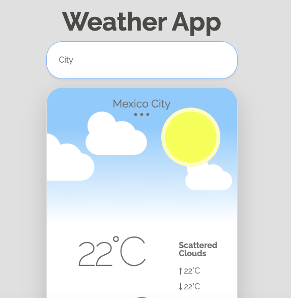

# Weather App

App developed using Vanilla JS and a bit of Bootstrap. Users search for a city and it displays the current weather in there. Data was fetched from the following API: https://openweathermap.org/api

Run `npm install` to install all the devDependencies.

Run `npm run start` to start the development server.

Run `npm run build` to build the app for production.
